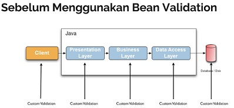

# Bean Validation
* Bean Validation merupakan standard spesifikasi untuk melakukan validation di Java
* Bean Validation sendiri merupakan spesifikasi yang masuk ke dalam teknologi Java Enterprise / Jakarta Enterprise
* Dengan Bean Validation, kita bisa membuat kode validation yang standard di Java
* https://jakarta.ee/specifications/bean-validation/ 

# Vibernate Validator
* Bean Validation hanyalah spesifikasi standard, isinya hanyalah kumpulan kontrak Interface dan Annotation, mirip seperti JDBC (Java Database Connectivity)
* Untuk implementasinya, kita butuh Driver untuk Bean Validation
* Hibernate Validator adalah salah satu driver atau implementasi Bean Validation yang paling populer saat ini
* https://hibernate.org/validator/ 

# Sebelum Menggunakan Bean Validation

# Menggunakan Bean Validation

# Jakarta Bean Validation
* Saat ini versi terbaru dari Bean Validation adalah versi 3, sedangkan masih banyak yang menggunakan Bean Validation versi 2
* Bean Validation versi 2 masih menggunakan nama Java Enterprise, sedangkan Bean Validation versi 3 sudah menggunakan nama Jakarta
* Oleh karena itu saat ini, banyak package untuk Bean Validation sudah berubah, dari yang sebelumnya menggunakan package javax.validation menjadi jakarta.validation
* Oleh karena itu jangan bingung jika masih  menggunakan  Bean Validation versi  2, tinggal diubah nama package nya saja
