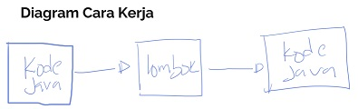

# Pengenalan Lombok
* Project Lombok adalah sebuah java library yang secara otomatis melakukan generate code Java
* Dengan project Lombok, kita tidak perlu membuat hal-hal secara manual seperti getter setter, equals method, toString dan lain-lain
* Project Lombok akan membuat kode-kode yang biasa kita buat menjadi otomatis dibuat, tanpa harus lakukan lagi secara manual
* https://projectlombok.org/ 

## Diagram
