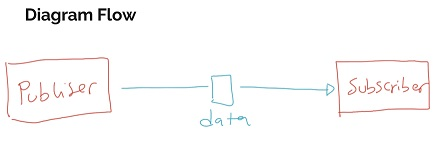

# Flow
Dalam Reactive Stream, kita mengenal istilah namanya Flow (aliran data), berbeda dengan yang sebelumnya sudah kita pelajari tentang Thread, dalam Reactive Stream, yang difokuskan adalah aliran data
Dalam aliran data, artinya ada yang mengirim data dan ada yang menerima data.
Pihak yang mengirim data, kita sebut Publisher, dan pihak yang menerima data, kita sebut Subscriber
Sebuah aliran data, kita sebut namanya Flow
https://docs.oracle.com/en/java/javase/16/docs/api/java.base/java/util/concurrent/Flow.html 

## diagram flow

>> Lanjutkan ke "Reactive Stream Classes.md"