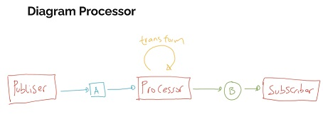

# Processor

Flow memiliki fitur yang bernama Processor yang direpresentasikan dalam interface Processor
Processor singkatnya adalah gabungan antara Publisher dan Subscriber, jadi dia bisa menerima data dari publisher lain lalu mengirim ke subscriber lain
Processor cocok jika kita ingin memanipulasi data publisher lalu hasilnya dikirim ke subscriber lain
https://docs.oracle.com/en/java/javase/16/docs/api/java.base/java/util/concurrent/Flow.Processor.html 

## Diagram Processor
